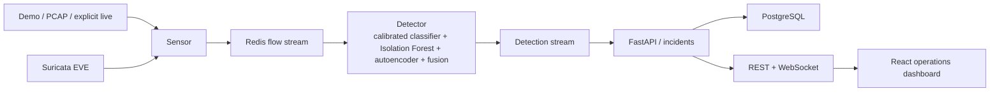

# AegisFlow

AegisFlow is an adaptive hybrid network intrusion detection system for deterministic
PCAP replay, explicit Linux live capture, explainable risk fusion, incident grouping,
and a real-time analyst dashboard.

> AegisFlow detects known threats and flags statistically unusual behaviour that may
> represent previously unseen threats.

It does not guarantee zero-day detection, inspect payloads by default, or block
traffic. The detector and offline demo require no LLM, API key, GPU, or internet
connection after dependencies and images are installed.

## Architecture



The demo profile runs `sensor`, `detector`, `api`, and `dashboard` as separate
processes with Redis and PostgreSQL. Tests can use the same domain logic with an
in-process adapter and SQLite.


## Quick start

Requirements: Docker with Compose, GNU Make, and enough space for Python/Node images.

```bash
make demo
```

Then open:

- Dashboard: <http://127.0.0.1:5173>
- API/OpenAPI: <http://127.0.0.1:8000/docs>
- Metrics: <http://127.0.0.1:8000/metrics>

The bundled traffic is synthetic and non-destructive. It produces ordinary flows,
a known-signature fixture, scan-like fan-out, a burst, and a statistically unusual
outbound transfer. Stop with `make demo-stop`.

Local development:

```bash
make install
make train-smoke
uv run python -m apps.api.main
npm --prefix apps/dashboard run dev
uv run python -m training.cli.evaluate_dataset --help
```

## Commands

```text
make lint
make typecheck
make test
make train-smoke
make replay PCAP=/absolute/path/capture.pcap
make live INTERFACE=eth0
make suricata-replay PCAP=/absolute/path/capture.pcap
make benchmark
make reset
```

`make live` is Linux-only, requires an explicit interface, and prints an authorization
warning. It builds a dedicated non-root NFStream sensor target with only `NET_RAW`;
the API and detector continue to drop every capability. The Suricata replay profile
has no network and accepts only an explicitly mounted PCAP. Never replay malicious
traffic onto a real network.

## Training and models

`make train-smoke` benchmarks logistic regression, a tree model, and a compact MLP on deterministic
synthetic data, uses a source-group split, fits preprocessing on the training fold
only, calibrates the selected classifier with grouped training-fold CV, and trains both
Isolation Forest and a compact denoising autoencoder on benign rows only. Bundle v2
includes the feature schema, preprocessing, classifier, both anomaly models, labels,
validation-derived thresholds, metrics, training provenance, artifact hashes, and
SHA-256 checksums. Production promotion is atomic and records rollback history; a
corrupt current bundle falls back visibly to the previous valid version.

Smoke metrics are only installation evidence. They are not claims about operational
quality. Public datasets are downloaded separately and never committed. See
[`docs/ML_METHODOLOGY.md`](docs/ML_METHODOLOGY.md) and
[`docs/DATASETS.md`](docs/DATASETS.md).

## Security and privacy

- Packet payloads are not retained.
- Raw IPs are excluded from the ML feature vector.
- Invalid/schema-incompatible flows produce errors, never benign results.
- Model files are checksummed before trusted local `joblib` deserialization.
- Containers run non-root, drop capabilities, use read-only filesystems where practical,
  and bind host ports to loopback.
- Analyst feedback never mutates an original detection.
- Drift cannot retrain or promote a model.
- Optional explanation providers receive only sanitized structured fields.

Read the full [`threat model`](docs/THREAT_MODEL.md) before live deployment.

## Known limitations

- The bundled model is synthetic smoke data, not a production model.
- The Scapy PCAP adapter is deterministic but deliberately compact. NFStream 6.6.0 is
  validated for PCAP and explicit Linux live interfaces; its Windows native engine is
  unavailable, so Windows falls back to Scapy replay.
- Windows supports demo and PCAP replay, not live capture.
- The bundled Isolation Forest and autoencoder are calibrated only against deterministic
  synthetic smoke data; independent public-dataset evaluation remains required before
  operational use.
- Redis/PostgreSQL restart recovery uses consumer groups, stale-entry claiming, durable
  acknowledgement, bounded retries, and idempotent event IDs. The Compose fault matrix is
  documented in `docs/PROGRESS.md`.
- No active response or automatic blocking is implemented.

## Upstream and license

The architecture was informed by `isaiah-harville/NIDS` at commit `277c4ff...`; all
AegisFlow runtime code is a clean rewrite. The upstream README says MIT, while its
actual root license is Apache-2.0. See [`UPSTREAM.md`](UPSTREAM.md) and the
[`upstream audit`](docs/UPSTREAM_AUDIT.md). AegisFlow preserves the actual
[Apache License 2.0](LICENSE).
