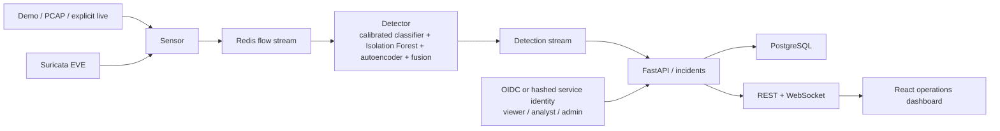
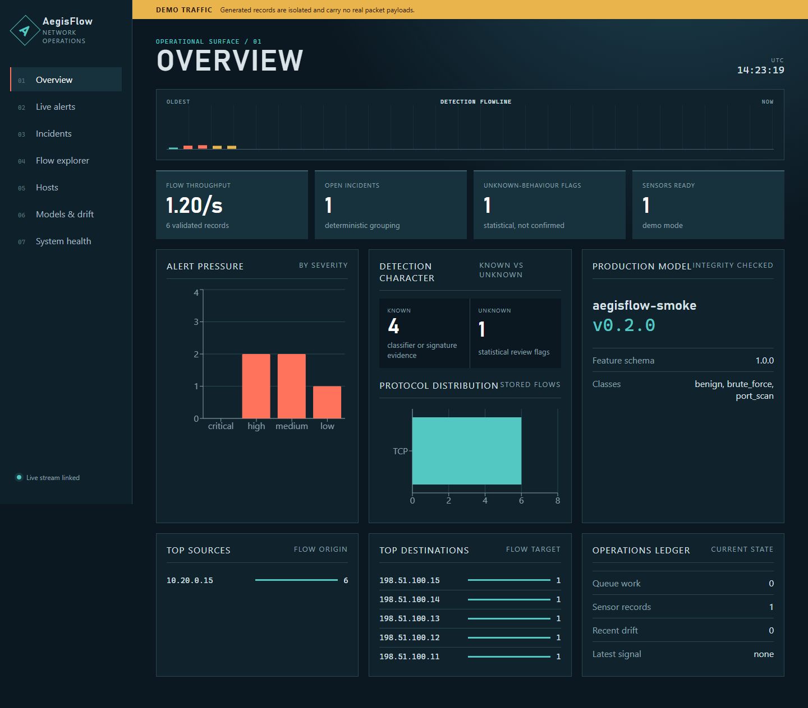

# AegisFlow

[](https://github.com/sting-raider/AegisFlow/actions/workflows/ci.yml)
[](LICENSE)

AegisFlow is an adaptive hybrid network intrusion detection system for deterministic
PCAP replay, explicit Linux live capture, explainable risk fusion, incident grouping,
and a real-time analyst dashboard.

> AegisFlow detects known threats and flags statistically unusual behaviour that may
> represent previously unseen threats.

It does not guarantee zero-day detection, inspect payloads by default, or block
traffic. The detector and offline demo require no LLM, API key, GPU, or internet
connection after dependencies and images are installed.

## Architecture



The demo profile runs `sensor`, `detector`, `api`, and `dashboard` as separate
processes with Redis and PostgreSQL. Tests can use the same domain logic with an
in-process adapter and SQLite.



## Quick start

Requirements: Docker with Compose, GNU Make, and enough space for Python/Node images.

```bash
make demo
```

Then open:

- Dashboard: <http://127.0.0.1:5173>
- API/OpenAPI: <http://127.0.0.1:8000/docs>
- Metrics: <http://127.0.0.1:8000/metrics>

The bundled traffic is synthetic and non-destructive. It produces ordinary flows,
a known-signature fixture, scan-like fan-out, a burst, and a statistically unusual
outbound transfer. Stop with `make demo-stop`.

The current clean validation replay persists 6 flows, 1 signature event, 5 alerts
(including distinct known-attack and suspicious-unknown results), and 1 incident. A
second replay leaves those counts unchanged because event IDs are deterministic and
database writes are idempotent.

Local development:

```bash
make install
make train-smoke
uv run python -m apps.api.main
npm --prefix apps/dashboard run dev
uv run python -m training.cli.evaluate_dataset --help
```

## Commands

```text
make lint
make typecheck
make test
make train-smoke
make replay PCAP=/absolute/path/capture.pcap
make live INTERFACE=eth0
make suricata-replay PCAP=/absolute/path/capture.pcap
make benchmark
make reset
```

## Verified status

The latest local validation on 2026-08-10 passed:

- Ruff and strict MyPy across 64 Python source files, including migrations;
- 145 Python tests with 84% backend coverage;
- dashboard ESLint, production build, 4 component interaction tests, and Chromium E2E;
- `npm audit --audit-level=high` with no reported vulnerabilities;
- clean Compose image builds, database migration through a mounted secret, offline replay,
  REST/auth checks, and independent Redis/PostgreSQL restart recovery;
- base, demo, live, Suricata, and production Compose validation plus a rendered Kustomize
  baseline;
- public GitHub Actions run `31340692583` passed Python, dashboard, deployment-render,
  live-loopback, API-replacement E2E, Gitleaks, and Trivy jobs;
- exact runtime batching and a local Redis-to-PostgreSQL Compose benchmark. The recorded
  2,000-flow detector comparison improved from 153.50 to 3,496.81 flows/s, while the
  full durable pipeline completed at 78.78 flows/s with zero final queue lag.

See [`docs/PROGRESS.md`](docs/PROGRESS.md),
[`docs/COMPLETION_AUDIT.md`](docs/COMPLETION_AUDIT.md), and
[`docs/PERFORMANCE.md`](docs/PERFORMANCE.md) for the measured evidence and its limitations.

`make live` is Linux-only, requires an explicit interface, and prints an authorization
warning. It builds a dedicated non-root NFStream sensor target with only `NET_RAW`;
the API and detector continue to drop every capability. The Suricata replay profile
has no network and accepts only an explicitly mounted PCAP. Never replay malicious
traffic onto a real network.

## Training and models

`make train-smoke` benchmarks logistic regression, a tree model, and a compact MLP on
deterministic synthetic data, uses disjoint grouped train/calibration/test partitions,
fits preprocessing on training rows only, calibrates the selected classifier with grouped
training-fold CV, and trains both Isolation Forest and a compact denoising autoencoder on
benign rows only. Bundle v3
includes the feature schema, preprocessing, classifier, both anomaly models, labels,
calibration-derived thresholds, a benign empirical anomaly CDF, fusion comparison metrics,
training provenance, artifact hashes, and SHA-256 checksums. Governed promotion binds
the exact bundle to exact-hybrid reports, requires independent human review and an admin
promoter, is atomic, and records rollback history. The detector requires a calibrated v3 bundle; older
v1/v2 history remains available for migration inspection but cannot perform inference.

Smoke metrics are only installation evidence. They are not claims about operational
quality. Public datasets are downloaded separately and never committed. See
[`docs/ML_METHODOLOGY.md`](docs/ML_METHODOLOGY.md) and
[`docs/DATASETS.md`](docs/DATASETS.md).

The repository includes reproducible exact-hybrid reports for the official UNSW-NB15
partitions and an official time-bearing CSE-CIC-IDS2018 capture. They cover published
train/test, chronological, leave-one-family-out, and genuinely cross-dataset modes through
the same batch predictor used by runtime detection. The evidence is deliberately candid:
the UNSW official split has a 64.4% benign false-positive rate; only 2.1% of a held-out
`exploits` family is directly detected as suspicious unknown; and UNSW-to-CSE transfer
classifies every benign CSE flow as non-benign. Every report fails the explicit readiness
gate, so no evaluated model is eligible for operational promotion. See
[`docs/evaluation`](docs/evaluation/) and the methodology notes below.

## Security and privacy

- Packet payloads are not retained.
- Raw IPs are excluded from the ML feature vector.
- Invalid/schema-incompatible flows produce errors, never benign results.
- Model files are checksummed before trusted local `joblib` deserialization.
- Containers run non-root, drop capabilities, use read-only filesystems where practical,
  and bind host ports to loopback.
- Analyst feedback never mutates an original detection.
- Drift cannot retrain or promote a model.
- Optional explanation providers receive only sanitized structured fields.
- Non-demo APIs and WebSockets require OIDC bearer tokens or hashed role-bearing service
  keys; server-derived viewer/analyst/admin roles control every sensitive operation.
- Model reports can reject automatically but cannot promote automatically; creator,
  reviewer, and promoter constraints plus rollback are durably audited.
- Mutation bodies, stream messages, stream length, and WebSocket connections/frames are
  bounded; rejected queue records retain only a structural summary and SHA-256 hash.
- Sensor, detector, API, access, and runtime application events use redacted one-line
  JSON logs, while Prometheus exposes flow, detection, queue, model, drift, WebSocket,
  and database health.

Optional incident explanations are disabled by default and run only when requested from
an incident. The deterministic explanation always remains available; configured remote
or loopback-local providers have timeout, retry, rate, privacy, and cache bounds. See
[`docs/AI_EXPLANATIONS.md`](docs/AI_EXPLANATIONS.md),
[`docs/AUTHENTICATION.md`](docs/AUTHENTICATION.md), and the production Compose/Kubernetes
guidance in [`docs/DEPLOYMENT.md`](docs/DEPLOYMENT.md). Read the full
[`threat model`](docs/THREAT_MODEL.md) before live deployment.

## Known limitations

- The bundled model is synthetic smoke data, not a production model.
- The real-data evaluation matrix is complete enough to reject the current model, not to
  approve it. UNSW official-split FPR is 64.4%; held-family direct unknown detection is
  2.1%; UNSW-to-CSE benign FPR is 100%; and the CSE chronological test misses essentially
  all later infiltration flows. These are negative evidence, not performance claims.
- OIDC/JWKS validation, hashed service identities, RBAC, WebSocket authentication,
  per-principal limits, and durable actor attribution are implemented and tested with
  controlled keys. A real organizational IdP, gateway-wide limits, session UX, and
  multi-tenancy have not been exercised by this repository.
- Runtime inference, Redis publication, acknowledgement, and PostgreSQL persistence are
  bounded and batched. Compose can partition detection across multiple replicas; a
  two-worker smoke exercised both workers. The recorded local numbers remain synthetic
  single-host evidence, not a production capacity claim.
- The Scapy PCAP adapter is deterministic but deliberately compact. NFStream 6.6.0 is
  validated for PCAP and explicit Linux live interfaces; its Windows native engine is
  unavailable, so Windows falls back to Scapy replay.
- Windows supports demo and PCAP replay, not live capture.
- The deployed smoke bundle remains calibrated against deterministic synthetic data.
  Public evaluation retrains the identical model families and fusion path for the
  reviewed dataset but does not promote the result.
- Redis/PostgreSQL restart recovery uses consumer groups, stale-entry claiming, durable
  acknowledgement, bounded retries, and idempotent event IDs. The Compose fault matrix is
  documented in `docs/PROGRESS.md`.
- No active response or automatic blocking is implemented.
- The production Compose override and Kustomize base render locally, but no external
  cluster rollout, managed-service integration, restore drill, or representative capacity
  validation is claimed.

The active production-readiness expansion and unresolved evidence requirements are
tracked in [`docs/COMPLETION_AUDIT.md`](docs/COMPLETION_AUDIT.md). The completed offline
demo should not be described as enterprise production-ready until that matrix closes.

## Upstream and license

The architecture was informed by `isaiah-harville/NIDS` at commit `277c4ff...`; all
AegisFlow runtime code is a clean rewrite. The upstream README says MIT, while its
actual root license is Apache-2.0. See [`UPSTREAM.md`](UPSTREAM.md) and the
[`upstream audit`](docs/UPSTREAM_AUDIT.md). AegisFlow preserves the actual
[Apache License 2.0](LICENSE).
