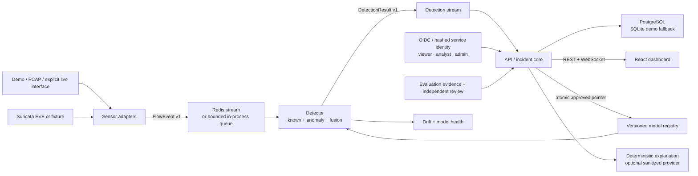

# Architecture

Runtime processes remain coarse: `sensor`, `detector`, `api`, and `dashboard`.
PostgreSQL, Redis, and optional Suricata are infrastructure. Training is an offline
CLI. The one-process demo composes the same adapters, contracts, feature pipeline,
detection engine, and repository used by distributed mode, so it is useful in CI
without pretending to validate infrastructure recovery.

Scapy provides the deterministic, portable PCAP fallback. NFStream 6.6.0 is the
completed-flow adapter for higher-fidelity PCAP and explicit Linux live capture.
Suricata 8.0.6 runs independently for signature evidence; its allow-listed EVE output
is correlated by community ID first, then normalized endpoints and bounded time.

Data contracts reject invalid input at boundaries. Events are idempotent by UUID.
Feature order and transformations are versioned; model bundles carry checksums,
thresholds, labels, metrics, and provenance. Payload storage and active response are
out of scope.

The API is also the model control plane. Outside demo mode, every versioned route and
WebSocket receives a server-derived principal. RBAC gates analyst actions, raw exports,
the audit ledger, and model governance. Candidate evidence is checksum-bound to the exact
bundle; failing gates can reject, but independent human review plus an admin promotion is
required before atomic pointer replacement. Runtime workers never hot-reload mid-batch;
promotion and rollback report that a controlled restart is required.

Both Redis hops use consumer groups with at-least-once delivery. A consumer acknowledges
only after publishing the next-stage event or committing the database transaction. Stale
pending entries are reclaimed after 30 seconds by default. Malformed events are first
written to the dead-letter stream; database/Redis outages remain visible as pending or
lagging queue work and retry metrics rather than being mislabeled benign.

The detector reads bounded groups, converts all valid rows through one exact hybrid batch,
publishes detection envelopes through one atomic Redis pipeline, then acknowledges their
source IDs together. Multiple detector replicas share the same consumer group for disjoint
work partitioning. The API persists bounded groups in one transaction and caches derived
incident context only for that transaction. One invalid row is quarantined without
poisoning valid rows; model-wide, Redis, or database failures leave work pending. See
[`PERFORMANCE.md`](PERFORMANCE.md) for measured stage and full-pipeline evidence.

The API-side durable consumer also feeds a bounded runtime drift monitor after a new
detection is persisted. It watches anomaly score, known-class confidence, normalized
flow rate, duration, byte volume, packet length, and alert rate. A threshold crossing
is stored idempotently before acknowledgement and exported as Prometheus count and
magnitude metrics. These windows observe distributions only: they never alter the
benign training baseline, create training labels, retrain, or promote a model.

Incident explanations form a separate on-demand read path. The repository derives an
endpoint-free aggregate envelope, the explanation service recursively applies its
allow-list, and either a deterministic template or explicitly configured provider
renders advisory text. Successful provider text is cached by the incident version.
Nothing in this path is imported by or called from the detector, and the result is never
consumed as an action.
