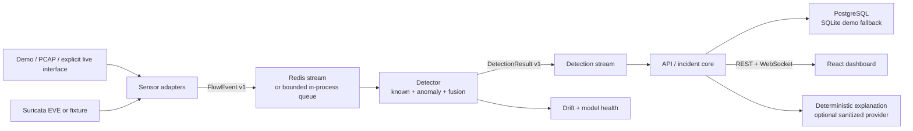

# Architecture

Runtime processes remain coarse: `sensor`, `detector`, `api`, and `dashboard`.
PostgreSQL, Redis, and optional Suricata are infrastructure. Training is an offline
CLI. The one-process demo composes the same adapters, contracts, feature pipeline,
detection engine, and repository used by distributed mode, so it is useful in CI
without pretending to validate infrastructure recovery.

Data contracts reject invalid input at boundaries. Events are idempotent by UUID.
Feature order and transformations are versioned; model bundles carry checksums,
thresholds, labels, metrics, and provenance. Payload storage and active response are
out of scope.
